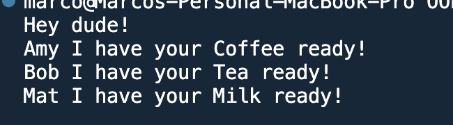

OOP Final Challenge
Your goal is to show your knowledge of OOP and Python. This is an assessment of your abilities and should show roughly where your CS skills are at.

The goal is to use OOP to create a coffee bar with customers who place orders. You'll define a person class to represent people that place orders, you'll define an order class that will represent an order that is placed at the coffee bar. You'll also define a CoffeeBar class that can take orders and process those orders. Last, the coffee bar will have a barista which is a sub-class of person.
## How to run the program:
- please run python3 CoffeeBar.py in your terminal.

## Decisions I made
- I modified the cash_out method in CoffeeBar. To provide more data to the user at the end of the day, I decided to print the list of recipts at Cashout becase I would imagine a manager would be doing this at the end of the day.
- I also added a grand total for the day, and summarized Kevin's earnings as well.
- I also adjusted the process_orders method. After implementing all the stretch goals, I noticed that it essentially overrid the process of the barista calling out each order. I was left in a situation where my work on the greeting was made obselete. As a result, I used template strings to print a more realistic greeting in the terminal.

## Challenge 1
- [x] Define a class that will represent a Person.

- [x] A person has a name and a favorite_drink.

- [x] A person has a my_order method that returns an Order of their favorite drink. You'll make the Order class next challenge and finish this method in challenge 3.

- [x]Result: you have defined a Person class and you should be able to initialize it. It has some attributes and a method (which is finished yet...)

## Challenge 2
- [x] Define an Order class. This class represents an order for a drink.

- [x] An order has a type and a person who made the order.

- [x] An order also has a to_string method that returns a string with the name of the person and the type of drink they ordered. The order string might look like this: "{customer name} orders: {drink type}"

- [x] Result: You have defined the Order class. It has some attributes and a method. You can initialize it with a Person and a type.

## Challenge 3
- [x] Finish the Person class. The my_order method should make an instance of Order which includes the person and their favorite drink.

- [x] Result: Calling a Person's my_order method should now return an Order instance for that person's favorite drink.

## Challenge 4
- [x] Create three instances of the Person class. Give each a different name and favorite drink.

    - [x] Amy - Coffee
    - [x] Bob - Tea
    - [x] Mat - Milk
- [x] Result: You have defined three person instances. Each has a unique name and a different favorite drink. Calling the my_order method on any Person instance should return an instance of an order.

## Challenge 3
- [x] CoffeeBar is a class that has a name and a list of orders.

- [x] It has a place_order method which takes an Order instance which it appends to its orders_list.

- [x] CoffeeBar also has a process_orders method which loops through all of the orders in the list and prints each order. Use each order's to_string method to print the name of the person that ordered and type of the order.

- [x] Result: You have defined the CoffeeBar class. It has a name and methods place_order and process_orders.

## Challenge 4
- [x] Create an instance of CoffeeBar. Give your CoffeeBar a name.

- [x] Result: You have created an instance of the Coffeebar class.

## Challenge 5
- [x] Have each of your three customers (Amy, Bob, Cat) place an order with your coffee bar.

- [x] You should be calling the person's my_order method to get the order and passing this to the coffee bar's place_order method.

- [x] Result: Your coffee bar has taken some orders.

## Challenge 6
- [x] Process all of the orders at your Coffeebar instance.

- [x] Call the process_orders method on your coffee bar instance.

- [x] Result: You should see each of the three orders you placed printed to the terminal.

## Challenge 7
- [x] Make a Barista class. This class extends the Person class and adds a greeting attribute.

- [x] Result: You have defined Barista as a sub-class of Person.

## Challenge 8
- [x] Make an instance of a barista named Kevin. Kevin's greeting is "Hey dude!"

- [x] Results: You have defined an instance of a barista with a greeting.

## Challenge 9
- [x] Add a new barista attribute to the CoffeeBar class.

- [x] Results: Coffeebar now has a Barista.

## Challenge 10
- [x] Assign your Barista, Kevin to your CoffeeBar instance.

- [x] Results: Your coffee bar has a Barista.

## Challenge 11
- [x]Modify the process_order method of the Coffeebar class so that it prints the barista's greeting before it prints the order string. For example, if 
- [x] Kevin is the barista processing an order should read something like: "Hey dude! Amy orders: Coffee"

- [x] Results: Your coffee bar should now process orders using the barista's greeting.

## Challenge 12 (stretch)
- [x] The following problems are all stretch goals. These are all optional problems to solve.

- [x] We need to track money spent. Give each Person a wallet property that holds a float. Imagine this is the amount of money that person has.

- [x] Initialize each person with an amount in their wallet.

- [x] Each order should have a price. Which is how much that order will cost. The Coffeebar can decide on the price based on the type.

- [x] A person should be charged for the order when the order is processed by the coffee bar.

- [x] A Coffeebar has a register property that holds the money taken in by the coffee bar. When processing an order subtract the cost of the order from the person's wallet and add that amount to the CoffeeBar's register.

- [x] Add a cash-out method to CoffeeBar that prints the amount of money in the register.

- [x] Track the receipts. Every time an order is placed we need to track the order. Give the CoffeeBar a receipts property. This should be a list. Each time an order is processed remove the order from the orders list and add it to the receipts list.

- [x] Kevin needs some tips! Give each person a tip amount. This is the amount that they tip.

- [x] Assign each person instance a different tip amount:

Amy - 20%
Bob - 18%
Cat - 15%
- [x] Give each order a tip amount. A person sets the tip amount when a person places an order they add the amount they tip to the order.

- [x] When calculating the cost of the order subtract the cost of the order plus the tip from each person's wallet. Add the order amount to the register.

- [x] Add a tip_jar attribute to the CoffeeBar class. When an order is processed add the tip amount to the tip jar.

- [x] After processing all orders add the tip jar to Kevin's wallet.